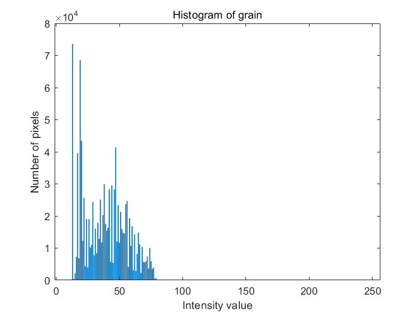
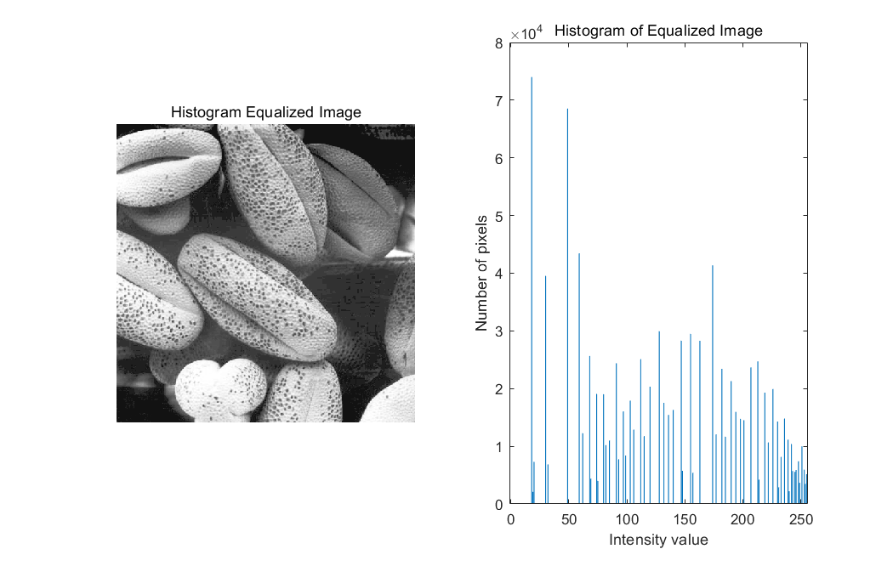
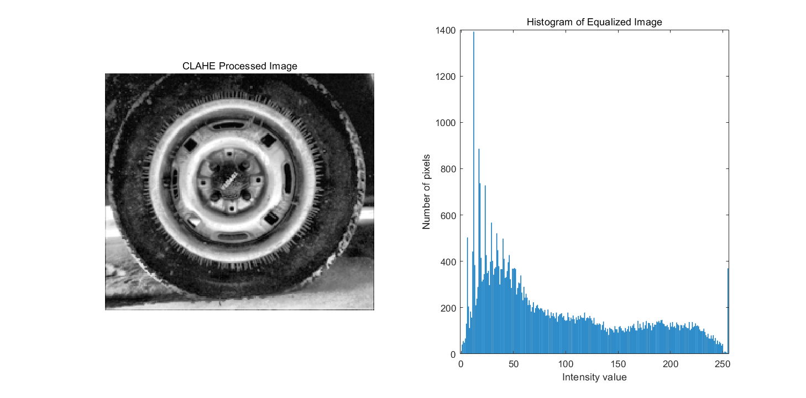
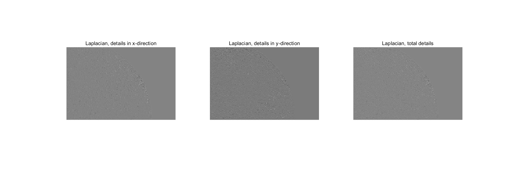
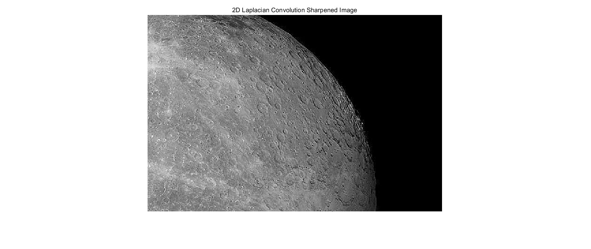
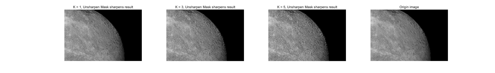
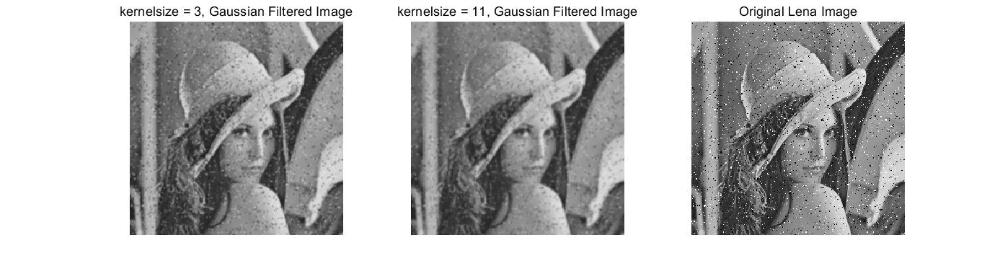
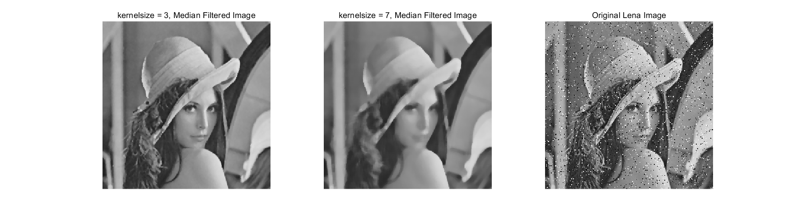

# CS270 - Digital - Image - Processing

## Problem 1: Histogram Equalization
(a)Histogram

(b)Histogram equalization

(c)CLAHE

## Problem 2: Image Sharpening
(a)Laplacian 1D
- kernel in x direction [1, -2, 1]
- kernel in y direction [1; -2; 1]

(b)Laplacian 2D
- Laplacian sharpened kernel [0,-1,0;-1,5,-1;0,-1,0];

(c)Unsharpen mask
- $ g_{mask}(x,y) = f(x,y) -\overline{f(x,y)}$ 
- $g(x,y) = f(x,y) + K* g_{mask}(x,y)$
- For this part, we can strenthen the high frequency of the image by increasing K value.

## Problem 3: Nonlinear Filter
(a)Gaussian filtered image:
- For Gaussian filter, when sigma is fixed, the larger the kernelsize, the smoother and blurrier the image is, as can also be seen in the image I have drawn. However, the quality of our image with this filter is still somewhat affected by noise due to the weighted average nature of the Gaussian filter. Thus, the black and white noise points, their Intensity value is 0/255, can not be eliminated, but just be attenuated  by surrounding pixel points.
- Therefore, for dealing with salt-and-pepper noise, the Gaussian filter, which is a linear filter, is not effective. It can only keep it down, not eliminate it completely

(b)Median filtered image:
- For the Median filter, we know that the filter is to sort all the pixels in the patch and take the middle value as the new Intensity value of the point, so for the black and white noise points, their Intensity value is 0/255, so it can effectively filter out their influence on the original image, and improve the quality of the original image. quality of the original image. Meanwhile, from the image I drew, we can see that the smaller the kernelsize is, the better the quality of the filtered image is; when the kernelsize is larger, the smoother the output result is, but it may also erase our useful signal features, thus reducing the quality of the output image. 
- Therefore, for dealing with salt-and-pepper noise, the Median filter, which is a nonlinear filter, is more effective.

